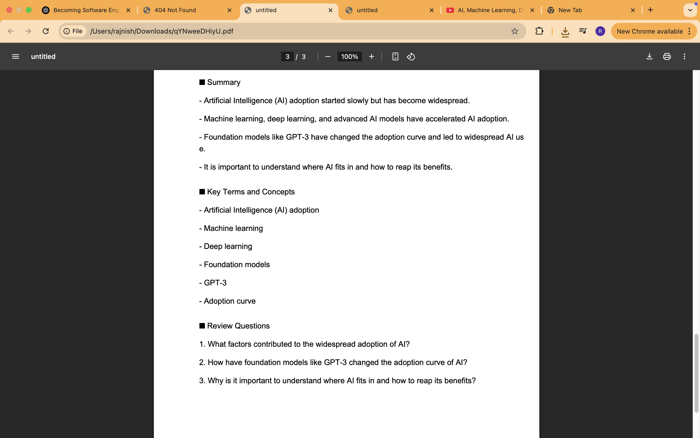

# 🎓 GenAI YouTube Tutor

A fullstack AI-powered tool that extracts YouTube lecture transcripts, summarizes key concepts, generates practice questions, and highlights main keywords — built to help learners retain and test their understanding more effectively.

---

## 🚀 Demo

🌐 [Live Demo](https://your-deployed-site.com)  
📦 [Frontend Repo](https://github.com/your-username/frontend-repo)  
🔧 [Backend Repo](https://github.com/your-username/backend-repo)

---

## 🧠 Features

- 🔍 Extracts **YouTube transcript** from video links
- 📄 Summarizes key concepts using **LLMs / LangChain + OpenAI**
- 🧪 Generates practice **quiz questions** (customizable difficulty)
- 📌 Identifies and displays **important keywords**
- 💾 Stores user sessions/history (MongoDB backend)
- 🖥️ Responsive and clean UI (React + Tailwind)

---

## 🛠️ Tech Stack

| Frontend           | Backend          | AI / NLP              | Database      |
| ------------------ | ---------------- | --------------------- | ------------- |
| React, TailwindCSS | Node.js, Express | LangChain, OpenAI API | MongoDB Atlas |

---

## ✨ How It Works

1. **User enters a YouTube link**
2. Transcript is fetched and parsed
3. LangChain/OpenAI API summarizes the content
4. Practice questions and keywords are extracted
5. All data is saved to MongoDB per user session

---

## 📸 Screenshots

| Home Page                                | Summary & Quiz View                           |
| ---------------------------------------- | --------------------------------------------- |
|  |  |

---

## 🧩 Folder Structure (Backend)

```
/backend
│
├── models/
│   └── History.js
├── routes/
│   └── history.js
├── .env
├── index.js
|
```

---

## 🧪 Setup Instructions

### 🔧 Prerequisites

- Node.js
- MongoDB Atlas URI
- OpenAI API Key
- Google API key

### 📦 Backend

```bash
cd backend
pip install
# Create a .env file with MONGO_URI and OPENAI_API_KEY and GOOGEL_API_KEY
npm start
```

### 💻 Frontend

```bash
cd frontend
npm install
npm run dev
```

---

## 📜 License

This project is open-source and free to use under the MIT license.

---

## 🙌 Acknowledgements

- [LangChain](https://www.langchain.com/)
- [OpenAI](https://platform.openai.com/)
- [YouTube Transcript API](https://pypi.org/project/youtube-transcript-api/)

---

## 👋 About Me

Hey! I'm a mining engineering grad passionate about software & GenAI. I built this project to improve learning using AI.  
🔗 [Portfolio](https://www.rajnishism.in) | 💼 [LinkedIn](https://linkedin.com/in/rajnishism)
